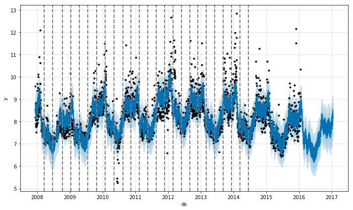
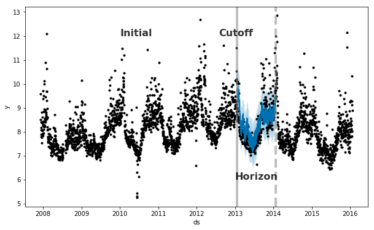

<style>
.math {
  font-size: small;
}
</style>

## **0 Before start**
***
If you are familiar with English, go to [4 Reference](#anchor). And this text is provided by [my Github repository](https://github.com/be-favorite/Tutorial_prophet)

## **1 Quick Start** {.tabset .tabset-fade .tabset-pills}

------------------------------------------------------------------------
첫 번째 챕터는 Quick Start로 Prophet 모형 적합의 디테일한 부분을
설명하지 않고, 러프하게 소개할 것이다.

### 1.1 Preparing

R에서 Prophet 모형을 제공하는 패키지는 {prophet}이다. 먼저 해당 패키지를
불러온다. 패키지가 설치되어 있지 않은 경우
`install.packages("prophet")`를 통해 CRAN(The Comprehensive R Archive
Network)에서 내려받을 수 있다. 그리고, 해당 예제에서 쓸 추가적인
패키지를 불러온다. {vroom}은 파일을 읽을 목적으로, {tidyverse}는 data
wragling, {lubridate}는 날짜를 다루기 위해 불러왔다. {lubridate}가
{base}의 날짜 함수들보다 훨씬 직관적이므로, 배워둘만한 가치가 있다(see,
`vignette("lubridate", package = "lubridate")`).

```{r}
library(tidyverse)
```

```{r, message = FALSE}
library(prophet)
library(lubridate)
library(vroom)
ggplot2::theme_set(theme_light())
loaded_package <- c("prophet", "vroom", "lubridate")
.version <- map(loaded_package, packageVersion)
names(.version) <- loaded_package
.version
```

[Facebook의 Github repository -
prophet](https://github.com/facebook/prophet)에서는 {Wikipediatrend}
패키지에서 스크랩한 다양한 예제 자료를 각 챕터에 맞게 제공하는데, Quick
Start에서는 [Peyton Manning(NFL의 쿼터백)의 위키피디아 페이지 일별 조회
수에 로그를 취한
자료](https://github.com/facebook/prophet/blob/master/examples/example_wp_log_peyton_manning.csv)를
사용할 것이다.

```{r, message = "FALSE"}
wp_log_peyton <- vroom("./data/example_wp_log_peyton_manning.csv", delim = ",")
glimpse(wp_log_peyton)
```

Prophet 모형을 적합하는 `prophet::prophet()`에서는 기본적으로 날짜를
나타내는 열 `ds`와 측정값(또는 관측값, observed values)을 나타내는 열
`y`을 갖는 데이터프레임을 요구한다(물론 티블도 문제없음). 따라서 해당 자료의 각 열의 이름과 그 성분은
`prophet()`에서 요구하는 것에 만족하므로, 따로 다른 처리를 해줄 것이
없다.

```{r}
summary(wp_log_peyton)
```
해당 자료는 2007-12-10부터 2016-01-20까지 일별로 기록된 자료임을 알 수
있다.

### 1.2 Quick view on Prophet

바로 Prophet을 적합해보자:

```{r, message = FALSE}
mod <- prophet(wp_log_peyton)
```

`prophet()`에는 조정할 수 있는 함수의 인수(argument)가 매우 다양한데,
이는 다음 챕터에서 자세하게 설명한다. Prophet 모형의 예측은 날짜를 나타내는 열
`ds`를 갖는 데이터프레임을 기반으로 만들어진다. 다음의
`make_future_dateframe()`은 모형 객체와 예측 기간의 수를 인수로 하여,
해당 예측 기간의 날짜를 `ds` 열로 하는 데이터프레임을 만들어준다. 향후
1년을 예측하기 위해 `periods` 인수에 365를 설정하였다:

```{r}
future <- make_future_dataframe(mod, periods = 365)
glimpse(future)
```

예측은 R의 예측 모델링에서 흔히 쓰이는 함수 `predict()`로 수행한다. 앞서
만든 데이터프레임과 모형객체를 인수로 받는다. 그런데 `predict()`와 같은
함수는 어떻게 다양하고 서로 다른 모형 객체를 인수로 받아 그에 알맞는
예측값을 제공해 줄까? 이것의 이해에는 객체지향 프로그래밍에 대한 개념이 필요하다. 튜토리얼의 내용과는 많이 벗어나므로 자세한 사항이 궁금하다면 [여기](https://be-favorite.tistory.com/72)를 참고하면 된다.

이제 다시 본론으로 돌아가서, 적합한 prophet 모형의 예측값을 생성하기
위해 `predict()`를 수행한다:

```{r, cache = TRUE}
pred <- predict(mod, future)
glimpse(pred)
```

Prophet 모형 객체에 `predict()`를 수행하면 여러 열을 갖는 데이터프레임
객체를 반환해준다. lower(하한)와 upper(상한)는 Prophet에서 제공하는
uncertainty interval에 해당하는데, 이 부분에 대한 설명은 챕터 3.5에서
자세하게 설명할 것이다. 본 챕터에서는 날짜, 예측값, 예측값의 하한, 상한
값만을 불러와서 검토해보자:

```{r}
pred %>% 
  select(ds, starts_with("yhat")) %>% 
  head()
```

그리고, `predict()`를 통해 반환된 예측값들을 갖는 객체와 Prophet 모형
객체로 `plot()`을 수행하면, uncertainty interval을 포함하는 관측값과
적합값의 시도표를 그릴 수 있다:

```{r, fig.align = "center", out.width = "60%", cache = TRUE}
plot(mod, pred)
```

위 그래프는 `dyplor.prophet(mod, pred)`를 이용하면 다음과 같이 interative하게 그릴 수도 있다:

<br>
<center>
```{r, warning = FALSE, out.width = "60%", echo = FALSE, cache = TRUE}
dyplot.prophet(mod, pred)
```
</center>
<br>

서론에서 Prophet 모형은 시계열을 3가지 요소(추세, 계절, 휴일효과)로
분해하고 각 요소를 시간의 함수로 모형화한다는 말을 했었다.
`prophet_plot_components()`를 이용하면 다음과 같이 시계열이 추세, 주별
계절성분, 연별 계절성분으로 분해된 것을 확인할 수 있다. 휴일효과는 모형
적합과정에서 반영하지 않았으므로 생략되었다. 휴일효과의 반영은 챕터
3.3.1에서 자세히 설명할 것이다.

```{r, fig.align = "center", out.width = "60%", cache = TRUE}
prophet_plot_components(mod, pred)
```

<br>

## **2 Details**

------------------------------------------------------------------------

이제 모형 적합에서 고려할 수 있는 세부적인 인수들에 대해 파헤쳐보자.

### 2.1 Saturaing Forecasts

Prophet에서는 예측값의 상한값과 하한값을 설정할 수 있다. 이를 영어로
Saturating Forecasts라 표현한다. 참고로, saturate는 "포화 상태로
만들다"라는 뜻이 있고 이를 풀어서 설명하면 어떤 것(st/sb)을 어떤 것으로
채우는 것이 불가능하도록 또는 채울 필요가 없도록 완전히 채우는 것을
말한다(to fill something/somebody completely with something so that it
is impossible or useless to add any more). 이번 챕터에서는 Facebook의
Github에서 제공하는 [R의 위키피디아 페이지 일별 조회 수에 로그를 취한
자료](https://github.com/facebook/prophet/blob/master/examples/example_wp_log_R.csv)를
사용할 것이다.

```{r, message = FALSE}
wp_log_r <- vroom("./data/example_wp_log_R.csv", delim = ",")
```

#### 2.1.1 Forecasting Growth

Prophet은 디폴트 설정으로 예측에 선형 모형을 사용한다. 어떤 시계열의
성장(growth)에 대한 예측을 수행할 때, 보통 해당 시계열이 취할 수 있는
최댓값이 존재한다(e.g. 총인구 수, 시장의 총 규모, etc.). 이를
"적재력(carrying capacity)"이라 칭하고, 예측값은 해당 지점에서
포화(saturate)되어야 한다. 그리고, Prophet에서는 예측에 선형 모형뿐만이
아닌 로지스틱 함수의 성장 추세(i.e. 비선형)를 갖는 모형을 사용할 수도
있으며, 해당 모형을 설정할 때는 적재력을 반드시 명시해야 한다. 다음과
같이 자료에 `cap` 열을 추가하여 적재력을 명시할 수 있다(Prophet의 성장
모형화는 자연 생태계의 인구 성장 추세와 유사함). toy data로 진행되는
이번 튜토리얼에서는 특정 값을 가정하여 사용할 것이나, 일반적으로는 시장
규모에 대한 전문적 지식이나 자료를 반영하여 설정된다.

```{r}
wp_log_r2 <- wp_log_r %>% 
  mutate(cap = 8.5)
```

주의할만한 점은 `cap`은 자료의 모든 행에 명시되어야 한다는 점이며, 꼭
상숫값만을 취해야 하는 것은 아니다. 만약 시장 규모가 성장한다면, `cap`도
증가하는 값을 갖도록 설정할 수 있다. 이제 `cap`을 설정한 자료를 바탕으로
비선형의 추세를 갖는 Prophet을 적합한다:

```{r}
mod_logistic <- prophet(wp_log_r2, growth = "logistic")
```

예측을 진행하는 다음의 과정은 전과 동일하나, `make_future_dateframe()`을
통해 생성되는 데이터프레임에도 cap을 명시해주어야 한다. 이번에는 향후
5년까지 예측을 수행할 것이다:

```{r, fig.align = "center", out.width = "60%", cache = TRUE}
future <- make_future_dataframe(mod_logistic, periods = 1826) %>% 
  mutate(cap = 8.5)
pred_logistic <- predict(mod_logistic, future)
plot(mod_logistic, pred_logistic)
```

#### 2.1.2 Saturating Minimum

로지스틱 성장 곡선의 추세를 갖는 Prophet 모형은 `floor`열을 명시하면
최솟값도 포화시켜 조정할 수 있다. 방식은 `cap`을 설정했던 것과 같다.

```{r, fig.align = "center", out.width = "60%", cache = TRUE}
wp_log_r3 <- wp_log_r2 %>% 
  mutate(
    y = 10-y,
    cap = 6,
    floor = 1.5)
future2 <- future %>% 
  mutate(
    cap = 6,
    floor = 1.5)
mod_logistic <- prophet(wp_log_r3, growth = "logistic")
pred_logistic <- predict(mod_logistic, future2)
plot(mod_logistic, pred_logistic)
```

아울러, 최솟값으로 포화하는 로지스틱 성장 추세의 모형을 사용할 경우,
반드시 적재력을 나타내는 열 `cap`도 명시하여야 한다.

### 2.2 Trend Changepoints

Prophet은 시계열의 변화점(changepoints)을 자동으로 탐지하고 추세에
적절하게 반영한다. 이번 챕터에서는 이러한 변화점에 관한 것을 조정할 수
있는 몇 가지 인수들을 소개하고자 한다.

#### 2.2.1 Automatic changepoint detection in Prophet {#anchor}

Prophet은 수많은 잠재적 변화점(changepoints)을 명시함으로써 변화점을
탐지한다. 각 잠재적 변화점에서는 변화가 일어날 비율(rate) $\delta_j$를 가지며, 여기서 $j = 1, \cdots,S$로 $S$는 고려할
변화점의 총 개수를 의미한다. 그리고, 추세 적합에 관여하는
$\boldsymbol{\delta}$는 희소 사전분포(sparse prior)를 따른다고 가정하며,
이는 Lasso 회귀(see more details
[here](https://be-favorite.tistory.com/46?category=908019))의 목적함수에
쓰이는 L1-regularization(if you don't know what it means, see
[here](https://be-favorite.tistory.com/30?category=894492))과 동일하다.
즉, 이는 본질적으로 Prophet 모형은 변화점이 될 수 있는 수많은 지점을
명시한 뒤에 그 중 가능한 한 적은 지점을 변화점으로 사용하게 될 것을
의미한다.

Prophet에서는 보통 많은 수의 변화점을 명시하고(e.g. 수년간 수집된 자료에
대해 월별로 변화점 명시) 사전분포로
$\delta_j \sim {\rm{Laplace}}(0, \tau)$를 사용한다(see details, [Talyor
and Letham (2018)](http://lethalletham.com/ForecastingAtScale.pdf) - 3.1
The Trend Model). 여기서 모수 $\tau$는 비율 $\delta_j$를 변화시킴으로써
모형의 유연성(flexibility)을 조절한다. 즉, 추세 적합의 조절모수는
$\tau$라 할 수 있다. 예를 들어, $\tau$를 0까지 감소시키면
일반적인(standard, not-piecewise) 로지스틱 또는 선형 성장 곡선을 갖는
추세를 이루게 된다(i.e. 변화점이 없는 것과 동일). 그리고, 앞서 추세
적합에 관여하는 사전분포를 Lasso 회귀의 목적함수에 쓰이는
L1-regularization과 같다고 했는데, 그 이유는 Lasso의 회귀계수
추정량을 베이지안 관점으로 풀어보면 회귀계수 추정량의 사전분포는 다음과
같기 때문이다($\sigma^2$은 $I$라 가정):

<br>

<center>

${\boldsymbol{\beta}} \sim {\rm{DE}}(0, \lambda I)$

</center>

<br>

여기서 조절모수 $\lambda$는 $\tau$와 같은 역할을 하고, ${\rm{DE}}$는
이중지수(double exponential) 분포로 다른 말로는 라플라스(Laplace)
분포라고 일컫는다. 이로써 둘은 완벽하게 같다는 것을 확인할 수 있다.

Quick Start 챕터에서 수행했던 Peyton Manning의 위키피디아 페이지 조회 수
예측을 고려해보면, Prophet은 다음 그림에서처럼 default로 25개의 잠재적
변화점을 시계열의 시작 날짜부터 80% 지점까지 균일하게 둔다:

```{r figure1, echo = FALSE, fig.cap = "출처: facebook.github.io", fig.align = "center", out.width = "60%"}

```

여기서 점선으로 그어진 수직선이 곧 잠재적 변화점을 의미한다. 수많은
잠재적 변화점을 두긴 했지만, 변화가 일어날 가능성($\delta_j$)의 조절이
희소 사전분포로 이루어지기 때문에 대부분의 변화점들은 사용되지 않을
것이다. 이는 각 변화점에서 비율의 크기를 시각화하여 확인할 수 있다:

```{r figure2, echo = FALSE, fig.cap = "출처: facebook.github.io", fig.align = "center", out.width = "60%"}
knitr::include_graphics("./fig/trendchangepoints_fig2.png")
```

잠재적 변화점은 default로 25개가 고려되는데, 모형 적합을 수행하는 함수
`prophet()`의 `n_changepoints` 인수 통해 조정할 수 있다. 다만,
`n_changepoints`은 자료에 따라 최적의 값이 다르므로 분석자의 직관에
의존하지 않은 regularization을 통한 튜닝이 필요로 될 것이다. 여기서
잠깐만 용어 정리를 하고 가자.

-   regularization: training error가 아닌 generalization error를 줄이는
    모든 행위를 통칭함. 즉, 해당 학습 알고리즘에 어떤
    수정(modification)을 가하는 행위를 말함.
-   generalization: 모형 적합에 쓰이지 않은 자료(unobserved data, i.e.
    test data)에도 좋은 성능을 보여주는 능력을 말함. 즉, 시험 자료(test
    data)에 대한 error는 generalization error에 해당.

이렇게 굳이 용어 정리를 하고가는 이유는, 위와 같이 [머신러닝에서 자주
등장하는 용어](https://be-favorite.tistory.com/30?category=894492)들을
간혹 머릿속에 정의가 확실하게 안된 채로 혼동하여 쓰는 경우를 많이 봤기
때문이다. 용어 정의가 확실히 안되면 글을 쓰는 사람, 읽는 사람, 강의를
하는 사람, 듣는 사람 모두가 힘들어
진다.`r emo::ji("disappointed_relieved")` 특히, 통계학, 머신러닝 등의
도메인에서는 정확한 용어 정의가 중요하다.

다시 본론으로 돌아와서, 이러한 잠재적 변화점들의 시각화는
`add_changepoints_to_plot()`을 이용하면 된다. {prophet}의 그림들은
{ggplot2} 형태로 그려지기 때문에, 다음과 같이 `+` 연산자를 사용하여
레이어를 쌓을 수 있다.

```{r, fig.align = "center", out.width = "60%", cache = TRUE}
plot(mod, pred) + 
  add_changepoints_to_plot(mod)
```

잠재적 변화점이 default로 시계열의 시작 날짜부터 80% 지점까지 설정되는
이유는 추세를 확실하게 파악하기 위해 충분한 시계열의 길이를 확보하기
위함이며, 끝의 20% 부분에서 잠재적 변화점을 고려하지 않는 이유는
시계열의 끝부분에서 탐지되는 변화점들에 의해 과적합이 일어나는 것을
방지하기 위함이다. 이러한 `prophet()`의 default 값은 꽤 잘 작동하는데,
모든 상황에서 그렇진 않으며 `changepoint_range` 인수을 통해 조정이
가능하다. 예를 들어, `prophet(data, changepoint.range = 0.9)`는 시작
지점부터 90% 지점까지의 잠재적 변화점을 고려하라는 말이다.

#### 2.2.2 Adjusting trend flexibility

만약 추세 변화가 과적합 또는 과소적합 되었다면, `change.prior.scale`로
희소 사전분포의 모수 $\tau$를 조정하여 추세 변화의 유연성(flexibility)을
조절할 수 있다. 즉, `change.prior.scale`의 크기($\tau$)를 키울수록 추세
변화는 flexible해지고, 과적합 가능성이 있을 것이다. 해당 인수의 default
값은 0.05로 설정되어 있다. 다음과 같이 0.5로 키우면 탐지된 추세가 더
flexible 해짐을 확인할 수 있다:

```{r, message = FALSE, fig.align = "center", out.width = "60%", cache = TRUE}
mod <- prophet(wp_log_peyton, changepoint.prior.scale = 0.5)
future <- make_future_dataframe(mod, periods = 365)
pred <- predict(mod, future)
plot(mod, pred)
```

반대로, 줄이면 다음과 같이 추세의 flexibility를 줄일 수 있다:

```{r, message = FALSE, fig.align = "center", out.width = "60%", cache = TRUE}
mod <- prophet(wp_log_peyton, changepoint.prior.scale = 0.001)
plot(mod, pred)
```

적절한 `changepoint.prior.scale`($\tau$)을 찾기 위해서는 튜닝이
필요하다. 이는 [2.8.2](#anchor)에서 다룰 것이다.

#### 2.2.3 Specifying the locations of the changepoints

마지막으로, 변화점의 위치를 자동으로 결정하는 것이 아닌 분석자가 그
위치를 명시할 수도 있다. `changepoint` 인수에 변화점이 놓이기를 원하는
날짜를 설정해주면 된다. 그럼 추세의 잠재적 변화점은 해당 지점에서만
고려될 것이다.

```{r, message = FALSE, fig.align = "center", out.width = "60%", cache = TRUE}
mod <- prophet(wp_log_peyton, changepoints = c("2014-01-01"))
plot(mod, pred) + 
  add_changepoints_to_plot(mod)
```

### 2.3 Seasonality, Holiday Effects, And Regressor

이번 챕터에서는 계절성, 휴일효과, 그리고 추가적인 회귀자(regressor)도
custom하는 것에 방법을 소개한다. 챕터 하나하나를 배우면서 자료의
특성을 완성도 있게 반영할 수 있는 당신만의 Prophet 모형을 설정할 수 있을
것이다.`r emo::ji("smile")`

#### 2.3.1 Modeling Holidays and Special Events

먼저, 휴일 또는 특별한 이벤트가 있는 날을 모델링하는 방법에 대해
알아보자. 휴일효과는 다음과 같이 직관적으로 반영할 수 있다:

```{r}
playoffs <- tibble(
  holiday = "playoff",
  ds = ymd(c("2008-01-13", "2009-01-03", "2010-01-16",
             "2010-01-24", "2010-02-07", "2011-01-08",
             "2013-01-12", "2014-01-12", "2014-01-19",
             "2014-02-02", "2015-01-11", "2016-01-17",
             "2016-01-24", "2016-02-07")),
  lower_window = 0,
  upper_window = 1
)
superbowls <- tibble(
  holiday = "superbowl",
  ds = ymd(c("2010-02-07", "2014-02-02", "2016-02-07")),
  lower_window = 0,
  upper_window = 1
)

holidays <- bind_rows(playoffs, superbowls)
```

NFL이 쿼터백 Peyton Manning의 위키피디아 페이지 일별 조회 수에 관한
자료이므로, 미국의 가장 큰 스포츠 행사 NFL의 챔피언십 슈퍼볼(Super
Bowl)의 플레이오프와 결승전을 휴일효과로 반영해보았다. 그리고, Prophet의
휴일효과 반영에서는 중요한 휴일 또는 특별한 이벤트가 있는 당일의 전후로
효과를 다르게 줄 수 있는데, 이를 반영 할 수 있는 열이 `lower_window`와
`upper_window`에 해당한다. 예를 들어, 위 코드처럼 `lower_window = 0`,
`upper_window = 1`을 설정하면 해당 이벤트의 다음 날에 다른 휴일효과를 주라는
뜻을 말한다. 이렇게 특정 휴일의 당일 전후에 효과를 포함시키는 것을 휴일의
창(a window of days)이라 칭한다. 특히, 우리나라의 추석이나 설과 같은
명절은 추석과 설 당일 전후로 휴일의 창을 반영해야 할 것이다.

```{r, message = FALSE, cache = TRUE}
mod <- prophet(wp_log_peyton, holidays = holidays)
pred <- predict(mod, future)
pred %>% 
  select(ds, playoff, superbowl) %>% 
  filter(abs(playoff + superbowl) > 0) %>%
  tail(10)
```

휴일효과가 반영된 결과는 위 코드블럭에서처럼 예측을 수행한 객체에서
확인할 수 있으며, 시계열을 3요소로 분해한 그림에서도 확인할 수 있다:

```{r, message = FALSE, fig.align = "center", out.width = "60%", cache = TRUE}
prophet_plot_components(mod, pred)
```

휴일효과를 반영하는 요소의 그림을 보면 플레이오프가 진행되는 날에 값이
튀고(spike), 특히 슈퍼볼 결승전에 크게 값이 튀는 것을 확인할 수 있다.
개개의 휴일효과를 확인해볼 수도 있다. 예를 들어, 슈퍼볼 결승전에 대한
휴일효과만을 확인 하고 싶다면
`plot_forecast_component(mod, forecast, "superbowl")`를 수행하면 된다.

#### 2.3.2 Built-in Country Holidays

{prophet}에서는 미국의 국경일 목록을 기본적으로 제공한다. 자세한 내용은
[여기서](https://github.com/dr-prodigy/python-holidays) 확인할 수 있다.
해당 페이지에서 확인할 수 있듯이 Python에서는 holidays라는 패키지를 통해
다양한 나라의 국경일 목록을 제공하고 있으나, 아쉽게도 R에서는 지원이
안된다. Facebook 너무하네..`r emo::ji("anger")` 기본적으로 제공되는
국경일 목록은 `add_country_holidays()`를 통해 불러올 수 있고, 다음과
같은 과정으로 적합한다. 사전에 우리가 설정했던 `holidays`를 반영하고, 그
뒤에 {prophet}에서 제공하는 미국의 국경일을 반영한 뒤에 자료에 prophet
모형을 적합한다.

```{r, message = FALSE, cache = TRUE}
mod <- prophet(holidays = holidays) %>% 
  add_country_holidays(country_name = "US") %>% 
  fit.prophet(wp_log_peyton)
```

모형 적합에 사용된 휴일효과에 대한 정보는 다음과 같이 확인할 수 있다:

```{r}
mod$train.holiday.names
```

마지막으로 해당 모형 객체로 예측을 수행한 뒤에, 반영된 휴일효과를
시각화하여 확인해보자:

```{r, message = FALSE, fig.align = "center", out.width = "60%", cache = TRUE}
pred <- predict(mod, future)
prophet_plot_components(mod, pred)
```

#### 2.3.3 Fourier Order for Seasonalities

Prophet에서는 푸리에 급수(fourier series)로 계절성을 추정한다(see
details, [Talyor and Letham
(2018)](http://lethalletham.com/ForecastingAtScale.pdf) - 3.2
Seasonality):

<br>
<center>
$s(t) = \sum_{n=1}^N (a_n cos(\frac{2 \pi nt}{P}) + b_n sin(\frac{2 \pi nt}{P}))$
</center>
<br>

푸리에 급수의 아이디어는 임의의 주기함수를 주기가 조금씩 다른 정현파(sin
함수, cos 함수)의 합으로 나타내는 것에 있으며, Prophet에서는 이
아이디어를 그대로 이용하여 계절성을 추정한다. 여기서 $N$을 푸리에
차수(order)라고 하며 크기를 키울수록 계절성은 flexible 하게
추정된다. 또한, sin 함수와 cos 함수에 대해 추정이 필요하므로 총 2N개의
모수 추정이 필요로 된다. 연별 계절성에 대한 푸리에 차수의 default 값은
10으로 Peyton Manning 자료의 연별 계절성은 다음과 같이 적합된다:

```{r, message = FALSE, fig.align = "center", out.width = "60%", cache = TRUE}
mod <- prophet(wp_log_peyton)
pred <- predict(mod, future)
prophet_plot_components(mod, pred)
```

마지막 그림을 확인하면 된다. Facebook에서 제공하는 예제에서는
`plot_yearly(mod)`를 수행하면 마지막 그림만을 보여주는데,
`help(package = "prophet")`을 해보면 해당 함수는 제공되지 않고 있다.
그래서, 되는대로 위 함수를 이용하고 있다.
`plot_forecast_component(mod, pred, "yearly")`도 이용할 수 있는데,
계절성의 변화를 1년에 걸쳐서 보여주는 위 그림과 달리 자료가 갖는 전
시점에서 계절성의 반복을 보여주다 보니 연별로 반복되는 계절성을 정확하게
파악하기 위해선 위 그림이 더 낫다고 판단하여
`prophet_plot_components()`를 이용하였다. 푸리에 차수의 크기를 키우면
계절성은 좀 더 복잡한 형태(more flexible)로 추정될 것이다:

```{r, message = FALSE, fig.align = "center", out.width = "60%", cache = TRUE}
mod <- prophet(wp_log_peyton, yearly.seasonality = 20)
pred <- predict(mod, future)
prophet_plot_components(mod, pred)
```

푸리에 차수 $N$을 지나치게 크게 설정하면, 과적합을 야기할 수 있으니
적당한 N 값을 설정하는 것이 좋다. 자료마다 편차가 존재하겠지만, 연별
또는 주별 계절성은 default로 각각 $N=10$, $N=3$이 설정되어있으며,
대부분의 문제에서 잘 작동한다. 아울러, 적절한 푸리에 차수 $N$의 결정은
교차검증을 통해 AIC와 같은 측도를 기준으로 결정할 수도 있다.

#### 2.3.4 Specifying Custom Seasonalities

시계열의 계절 주기가 둘 이상인 경우, Prophet은 default로 주별 계절성과
연별 계절성을 적합한다. 또한, sub-daily 자료(i.e. YYYY-MM-DD HH:MM:SS)일
경우 default로 일별 계절성을 적합할 것이다. 여기서 더 나아가,
Prophet에서는 `add_seasonality()`로 다른 계절성들(i.e. monthly,
quarterly, hourly)을 모형에 반영할 수 있다. 해당 함수에서는 원하는
계절성 주기, 한 주기의 지속 시기(float number of days in one period),
푸리에 차수를 지정할 수 있다. 아울러 추가적인 인수로 계절성에 과적합
또는 과소적합의 문제가 보일 때, 계절성에 대한 사전분포의 크기($\tau$)를
조정할 수 있는데 이는 [2.3.6](#anchor)에서 다루려고 한다. 다음의 예는
Peyton Manning 자료에 default로 적합되는 주별 계절성 대신 월별 계절성을
적합한 것이다:

```{r, message = FALSE, fig.align = "center", out.width = "60%", cache = TRUE}
mod <- prophet(weekly.seasonality = FALSE) %>% 
  add_seasonality(name = "monthly", period = 30.5, fourier.order = 5) %>% 
  fit.prophet(wp_log_peyton)
pred <- predict(mod, future)
prophet_plot_components(mod, pred)
```

#### 2.3.5 Seasonalities that depend on other factors

시계열 자료의 계절성은 다른 요인에 의존할 수도 있다. 예를 들어, 여름에는
주별 계절성의 패턴이 다르다거나, 주중 그리고 주말의 일별 계절적 패턴이
다른 경우가 있을 수도 있다. Prophet에서는 이러한 유형의 계절성도 조건부
계절성을 사용하여 모델링할 수 있다.

Peyton Manning 자료에 대해 이를 적용해보자. 주별 계절성은 default로 그
패턴이 1년 내내 동일하다고 가정한다. 그러나, Peyton Manning 자료의 주별
계절성의 패턴은 NFL의 시즌이 진행 중(on-season)일 때(일요일마다 경기가
있을 때)와 시즌이 종료된 시기(off-season)일 때 다를 것이라 기대할 수
있다. 이러한 주별 계절성은 on-season, off-season으로 주별 계절성을
분리하는 조건부 계절성을 사용하여 반영할 수 있다.

먼저 자료와 예측의 수행에 필요한 날짜 열을 갖는 데이터프레임에 각 날짜의
on-season, off-season 여부를 나타내는 logical vector 열을 각각
추가해준뒤, 조건부 계절성을 반영한 모형을 적합하고 예측을 수행한다. NFL
시즌은 9월부터 1월까지 진행된다:

```{r, message = FALSE, fig.align = "center", out.width = "60%", cache = TRUE}
is.nfl_season <- function(ds){
  month(ds) >= 9 | month(ds) <= 1
}
wp_log_peyton_season <- wp_log_peyton %>% 
  mutate(
    on_season = is.nfl_season(ds),
    off_season = !is.nfl_season(ds)
    )
future_season <- future %>% 
    mutate(
    on_season = is.nfl_season(ds),
    off_season = !is.nfl_season(ds)
    )

mod_season <- prophet(weekly.seasonality = FALSE) %>% 
  add_seasonality(name = "weekly_on_season", period = 7, fourier.order = 3, condition.name = "on_season") %>% 
  add_seasonality(name = "weekly_off_season", period = 7, fourier.order = 3, condition.name = "off_season") %>%
  fit.prophet(wp_log_peyton_season)

pred_season <- predict(mod_season, future_season)
prophet_plot_components(mod_season, pred_season)
```

우리가 custom한 두 계절성을 위 그림에서 비교할 수 있다. 일요일마다
경기가 치뤄지는 NFL의 on-season을 나타내는 계절성의 경우 일요일과
월요일에 큰 증가가 있으나, off-season인 경우 일요일과 월요일에 딱히
증가가 없다(see the $y$-axis).

#### 2.3.6 Prior scale for holidays and seasonality

휴일효과와 계절성도 추세 적합에서처럼 과적합이 일어난 경우에 사전분포의
모수 조정을 통한 평활로 곡선의 형태를 덜 복잡하게(less flexible) 만들 수
있다.

예를 들어, 푸리에 차수 $N = 10$인 연별 계절성분을 $X(t)$라 하면:

<br>
<center>
$X(t) = [cos(\frac{2 \pi (1)t}{365.25}), \cdots, sin(\frac{2 \pi (10)t}{365.25})]$
</center>
<br> 

Prophet의 계절 요소는 다음과 같이 추정된다:

<br>
<center>
$s(t) = X(t) {\boldsymbol{\beta}}$
</center>
<br>

여기서 ${\boldsymbol{\beta}} \sim {\rm{Normal}}(0, \sigma^2)$으로
계절성에 대한 평활 사전분포를 가정한다. 즉, $\sigma^2$을 조절모수(tuning
parameter)라고 할 수 있다. (see details, [Talyor and Letham
(2018)](http://lethalletham.com/ForecastingAtScale.pdf) - 3.2
Seasonality)

휴일효과도 계절성과 유사한 방식으로 추정된다. 반영하고자 하는 각
휴일효과를 $i$라 하고, 각 휴일효과의 과거 및 미래 날짜들의 집합을
$D_i$라 하자. 그럼 시계열의 임의의 시점 $t$가 휴일 $i$에 포함되는지를
나타내는 지시함수를 정의할 수 있다. 예를 들어, 고려하고자 하는
휴일효과가 $1, 2, \cdots, L$개 존재한다고 하면, 앞서 계절성분을 정의했던
것과 유사하게 휴일효과에 대한 요소를 다음과 같이 정의할 수 있다:

<br>
<center>
$Z(t) = [{\boldsymbol{1}}(t \in D_1), \cdots, {\boldsymbol{1}}(t \in D_L)]$.
</center>
<br>

그럼, Prophet의 휴일효과는 최종적으로 다음과 같이 추정된다:

<br>
<center>
$h(t) = Z(t) {\boldsymbol{\kappa}}$.
</center>
<br>

여기서 ${\boldsymbol{\kappa}} \sim {\rm{Normal}}(0, \nu^2)$으로 계절성과
마찬가지로 평활 사전분포를 가정한다. 즉, 휴일효과의 조절모수는
$\nu^2$이라 할 수 있다. 아울러, 휴일효과의 경우 [2.3.1](#anchor)에서
휴일의 창이라는 효과를 통해 추석 또는 설 당일과 같은 명절의 주변 일자를
지정하여 효과를 다르게 줄 수 있다고 언급했었는데, 이렇게 휴일의 창으로
고려되는 날짜들 또한 각 날짜를 본질적으로 휴일 그 자체로 다루어 추정을
수행하기 때문에 가능해지는 것이다(see details, [Talyor and Letham
(2018)](http://lethalletham.com/ForecastingAtScale.pdf) - 3.3 Holidays
and Events).

계절성과 휴일효과의 적합을 조절하는 각 모수 $\sigma^2$과 $\nu^2$도 추세
적합을 조정하는 모수 $\tau$와 같이 그 크기를 키울수록 복잡한 효과를
추정하게 되고, 그에 따라 과적합의 우려가 커질 것이다. 그리고, 둘에 관해
마지막으로 언급하고 싶은 점은 [2.2.1](#anchor)에서 추세 적합에 관여하는
사전분포는 곧 Lasso 회귀의 L1-regularization과 같다고 했었는데,
계절성과 휴일효과에 관여하는 두 사전분포는 Ridge 회귀((see more details
[here](https://be-favorite.tistory.com/29?category=908019)))의
L2-regularization과 같다. 마찬가지로 Ridge의 회귀계수 추정량을
베이지안 관점으로 풀어서 회귀계수 추정량의 사전분포를 구해보면 알 수
있다($\sigma^2$은 $I$라 가정):

<br> 
<center>
${\boldsymbol{\beta}} \sim {\rm{Normal}}(0, \tau^2 I)$ 
</center>
<br>

단, 여기서 $\tau^2$은 $\frac{\sigma^2}{\lambda} = \frac{I}{\lambda}$에
해당한다($\sigma^2$은 계절성의 사전분포를 조절하는 모수가 아닌 분산을
의미한다). 이로써, 계절성과 휴일효과 각각의 사전분포를 조절하는
$\sigma^2$, $\nu^2$은 Ridge 회귀 추정량의 사전분포를 조절하는 $\tau^2$와
정확하게 동일함을 확인했다.

먼저 휴일효과는 `holidays.prior.scale`로 $\nu^2$의 조정을 수행할 수
있다. default는 10으로 설정되어 있다.

```{r, message = FALSE, cache = TRUE}
mod <- prophet(wp_log_peyton, holidays = holidays, holidays.prior.scale = 0.05)
pred <- predict(mod, future)
pred %>% 
  select(ds, playoff, superbowl) %>% 
  filter(abs(playoff+superbowl) > 0) %>% 
  tail(10)
```

[2.3.1](#anchor)의 3번째 코드블럭의 결과와 비교해보면, 특히 superbowl
휴일효과의 크기가 약해졌음을 확인할 수 있다. 계절성의 경우
`seasonality.prior.scale`로 $\sigma^2$을 조정할 수 있다. 아울러,
사전분포의 크기는 더 세밀하게 조정이 가능하다. 예를 들어, 휴일효과의
경우 휴일효과에 대한 정보를 갖는 데이터프레임에 `prior.scale` 열을
만들어서 각 휴일효과에 대한 사전분포 크기의 조정이 가능하다. 계절성의
경우 `add_seasonality`를 통해 각 계절성의 사전분포 모수 $\sigma^2$을
조정할 수 있다. 예를 들어, 주별 계절성을 반영하는 사전분포의
$\sigma^2$은 다음과 같이 설정할 수 있다:

```{r, message = FALSE, cache = TRUE}
mod <- prophet() %>% 
  add_seasonality(name = "weekly", period = 7, fourier.order = 3, prior.scale = 0.1)
```

#### 2.3.7 Additional regressors

Prophet에서는 `add_regressor`를 사용하여 추가적인 회귀자(regressor)를
모형에 반영할 수 있다. 회귀자는 모형 적합에 쓰이는 데이터프레임과 예측에
필요한 데이터프레임 모두에서 명시되어야 한다. 예를 들어, 우리는 다음과
같이 NFL 시즌 동안 일요일에 추가적인 효과를 추가할 수 있다. 반영된
효과는 마찬가지로 `prophet_plot_components()`에서 확인할 수 있다:

```{r, message = FALSE, fig.align = "center", out.width = "60%", cache = TRUE}
nfl_sunday <- function(ds) {
  month <- month(ds)
  as.numeric(
    (wday(ds, label = TRUE, abbr = FALSE) == "일요일") & (month >= 9 | month <= 1)
  )
}
wp_log_peyton_sun <- wp_log_peyton %>% 
  mutate(
    nfl_sunday = nfl_sunday(ds)
  )
mod_sun <- prophet() %>% 
  add_regressor("nfl_sunday") %>% 
  fit.prophet(wp_log_peyton_sun)
future_sun <- future %>% 
  mutate(
    nfl_sunday = nfl_sunday(ds)
  )
pred_sun <- predict(mod_sun, future_sun)
prophet_plot_components(mod_sun, pred_sun)
```

물론, NFL 시즌 중의 일요일은 모형 적합 과정에서 과거와 미래의 NFL 시즌
중의 일요일의 날짜 목록을 만들어 `holidays` 인수에 반영함으로써,
휴일효과로도 모형화가 가능하다. 그러나, `add_regressor`의 경우
`holidays`에 비해 추가적인 회귀자를 고려할 수 있는, 보다 일반적인
인터페이스를 제공한다. 특히, 회귀자는 이진형 지표만을 요구하는 것이
아니며, 또 다른 시계열을 회귀자로 사용할 수도 있다. 다만, 회귀자로
사용할 시계열의 경우 모형 적합에 쓰이는 과거값뿐만 아니라, 예측 날짜에
해당하는 미래값도 알려져 있어야 한다.

회귀자로 쓰고 싶은 시계열 자료에 과거값만 주어질 경우 한 가지 방법이
있다. 예를 들어, $y(t)$를 Prophet으로 모형화하는데 시계열 $r(t)$를
회귀자로 포함시킬 경우, Prophet으로 먼저 $r(t)$의 미래값을 예측하고 해당
값들을 $y(t)$의 회귀자로 사용하는 것이다. 그러나, 이러한 방식은 $r(t)$가
$y(t)$보다 예측하기 쉬운 경우에만 유용할 수 있다. 그 예로 하위 수준의
예측보다 최상위 수준(top-level)의 예측에서 더 높은 SNR(signal to
noise ratio)을 갖는 계층적 시계열을 들 수 있다. SNR이 더 높다는 말은 곧
잡음(noise)이 더 작다는 말이며, 이는 즉 최상위 수준의 예측이 더 쉽다는
것을 뜻한다. 이러한 경우에, 최상위 수준의 예측값은 하위 수준의 각 시계열
예측의 회귀자로 쓰일 수 있다.

이번 예제에서 회귀자는 default로 가법(additive) 요소로 고려되었으며,
승법(multiplicative) 요소로도 고려될 수 있다. 다음 섹션이
승법성(mutiplicativity)에 대한 내용에 해당한다.

### 2.4 Multiplicative Seasonality

Prophet 모형은 기본적으로 계절성을 가법적 요소로 적합하며, 이는 곧 추세
요소에 계절성의 효과를 더하여 예측을 수행함을 의미한다. 그러나, 증가
추세를 갖는 시계열에서 계절성의 크기도 증가하는 경우엔 계절성을
승법적으로 고려해야 한다. 다음의 [여객기 승객 수에 관한 일별
자료](https://github.com/facebook/prophet/blob/master/examples/example_air_passengers.csv)가 가법적 계절성이 작동하지 않는 예에 해당한다:

```{r, message = FALSE, fig.align = "center", out.width = "60%", cache = TRUE}
air <- read_csv("./data/example_air_passengers.csv")
mod <- prophet(air)
future <- make_future_dataframe(mod, 50, freq = "m")
pred <- predict(mod, future)
plot(mod, pred)
```

해당 시계열은 명확하게 연도별(yearly) 계절성을 갖는 것으로 보이지만,
시계열의 시작점에서는 적합된 계절성이 너무 크고 끝부분에서는 적합된
계절성이 너무 작다. 그 이유는, 해당 자료의 계절성은 Prophet 적합
과정에서 가정한 것처럼 가법 요소가 아닌, 추세에 따라 증가하는 승법적
계절 요소에 해당하기 때문이다.

승법적 계절성은 `seasonality.mode = "multiplicative"`로 설정할 수 있다:

```{r, message = FALSE, fig.align = "center", out.width = "60%", cache = TRUE}
mod <- prophet(air, seasonality.mode = "multiplicative")
pred <- predict(mod, future)
plot(mod, pred)
```

계절성이 추세의 증가에 알맞게 반영되어, 계절성이 잘 잡힌 모습을 확인할
수 있다. 시계열의 추정된 각 요소를 나타내는 그림을 그려보면 추세의 백분율(%)로 계절성이 나타난다:

```{r, message = FALSE, fig.align = "center", out.width = "60%", cache = TRUE}
prophet_plot_components(mod, pred)
```

휴일효과도 계절성처럼 승법적으로 모형화가 가능하다. 그리고,
`seasonality_mode`에서 설정한 것에 따라 추가적인 계절성이나 회귀자도
해당 설정을 따르나, 계절성이나 회귀자를 추가할 때 `mode = "additive"`
또는 `mode = "multiplicative"`를 명시함으로써 기본 설정은 무시되도록
분석자가 원하는 요소로 반영할 수 있다.

```{r, cache = TRUE}
mod <- prophet(seasonality.mode = "multiplicative") %>% 
  add_seasonality("quarterly", period = 91.25, fourier.order = 8, mode = "additive") %>% 
  add_regressor("regressor", mode = "additive")
```

가법적 회귀자와 승법적 회귀자는 시계열의 각 요소를 나타내는 그림에서
분리된 패널에 그려진다. 그러나, 가법적 계절성과 승법적 계절성이 혼합되어
나타날 가능성은 거의없으므로, 일반적으로 이러한 계절성이 있을거라
예상하는 이유가 존재하는 경우에만 사용된다.

### 2.5 Uncertainty Intervals

Prophet은 기본적으로 예측값 \`yhat에 대한 uncertainty intervals을
제공한다. 예측의 uncertainty에는 3가지 요소(추세, 계절성, 추가적인 관측
잡음)가 있으며, uncertainty intervals에는 몇몇 중요한 가정이 있다는 점을
알아둬야 한다.

#### 2.5.1 Uncertainty in the trend

먼저 추세 요소에 대한 예측의 uncertainty에 관해 알아보자. 예측의
uncertainty에 대한 가장 큰 요소는 미래의 추세 변화에 대한 가능성을
반영하는 추세 요소라 할 수 있다. 이번 튜토리얼에서 지금까지 다룬
시계열들은 과거에 명확한 추세 변화를 보여주었으며, Prophet은 이를
탐지하고 적합한다. 그러나, 과거에 발생했던 추세 변화의 패턴이 쭉
이어진다고 과연 기대할 수 있을까? 이를 확실히 아는 것은 당연히
불가능하고, Prophet에서는 이를 미래는 과거와 비슷한 추세를 띨 것이라는
가정하에 최대한 합리적으로 처리한다. 좀 더 구체적으로 말하면,
Prophet에서는 미래의 추세 변화의 평균적 크기와 주기가 과거에서 우리가
관측했던 바와 같을 것이라 가정한다. 이를 통해 미래의 추세 변화를
예측하고, 그들의 분포를 계산하여 uncertainty intervals을 얻는다. 그래서,
이러한 가정때문에 사실 추정된 uncertainty intervals이 정확한 범위를
가질거라 기대하긴 어렵다.

그러나, uncertainty intervals은 과적합의 유용한 척도가 된다. uncertainty
측정 방법의 한 가지 특성(property)은 `changepoint.prior.scale`($\tau$)를
키워 유연성(flexibility)를 높일 경우 예측의 uncertainty가 증가한다는
점인데, 이는 직관적으로도 당연하다. 추세 변화의 유연성을 키우면 더 많은
변화점이 탐지될 가능성이 커지고, 좀 더 복잡한 곡선을 적합하게 될
것이므로 미래 시점에 복잡한 추세 변화를 가정할 수록 당연히 uncertainty는
커질 것이기 때문이다.

Prophet에서 uncertainty intervals의 기본적인 범위는 80%이며,
`interval_width`를 통해 조정할 수 있다:

```{r, message = FALSE, echo = TRUE, eval = FALSE, cache = TRUE}
prophet(air, interval.width = 0.95) %>% 
  predict(future)
```

#### 2.5.2 Uncertainty in seasonality

Prophet은 기본적으로 추세와 관측 잡음에 대한 uncertainty만 제공하는데,
계절성에 대한 uncertainty를 얻기 위해서는 `mcmc.samples` 인수를 설정하여
베이지안 표집(Bayesian sampling)을 수행해야 한다. `mcmc.samples`는
기본적으로 0으로 설정되어 있으며, 이름에서 알 수 있듯이 베이지안 표집
방법 중 하나인 MCMC(Markov Chain Monte Carlo, 마코프 체인 몬테카를로)를
통해 계절성의 경험적 사후 분포(empirical posterior distribution)를
추정한다. 다음은 이를 Peyton Manning 자료의 6개월 예측에 수행한 것이다.
샘플 수가 커질 수록 추정은 오래 걸릴 것이다:
```{r, message = FALSE, warning = FALSE, results = "hide", cache = TRUE}
mod <- prophet(wp_log_peyton, mcmc.samples = 300)
```

사후 예측 표본에 대한 값은 `predictive_samples(mod, future)`로 확인할 수 있다:
```{r, message = FALSE, warning = FALSE, cache = TRUE}
future <- make_future_dataframe(mod, periods = 30.5*6)
pred <- predict(mod, future)
prophet_plot_components(mod, pred)
```

### 2.6 Outliers

이상점(outliers)은 2가지 방식으로 Prophet 모형의 예측값에 영향을 미칠 수
있다. 이번 챕터에서는 [이상점이 포함된 R의 위키피디아 페이지
일별 조회 수에 로그를 취한
자료](https://github.com/facebook/prophet/blob/master/examples/example_wp_log_R_outliers1.csv)를
사용할 것이다:

```{r, message = FALSE, fig.align = "center", out.width = "60%", cache = TRUE}
wp_outlier <- vroom("./data/example_wp_log_R_outliers1.csv", delim = ",")
mod_outlier <- prophet(wp_outlier)
future_outlier <- make_future_dataframe(mod_outlier, periods = 1096)
pred_outlier <- predict(mod_outlier, future_outlier)
plot(mod_outlier, pred_outlier)
```

적합된 추세는 꽤 합리적이여 보이긴 하지만, 예측값의 uncertainty
intervals이 지나치게 넓게 추정되고 있다. 사실 Prophet에서 이상점을
처리하는 가장 좋은 방법은 이상점들을 제거하는 것이다. Prophet은 결측이
있는 자료에도 문제없이 작동하기 때문이다. 과거값에 존재하는 이상점들을
`NA`로 처리하면, `make_future_dataframe()`을 통해 생성되는 예측에 필요한
객체에는 해당 날짜가 남아있을 것이며 Prophet은 해당 값에 대한 예측까지
제공해 줄 것이다.

```{r, message = FALSE, fig.align = "center", out.width = "60%", cache = TRUE}
wp_outlier_rmv <- wp_outlier %>%
  filter(ds <= ymd("2010-01-01") | ds >= ymd("2011-01-01") )
mod_outlier_rmv <- prophet(wp_outlier_rmv)
pred_outlier_rmv <- predict(mod_outlier_rmv, future_outlier)
plot(mod_outlier_rmv, pred_outlier_rmv)
```

앞서 다뤄본 이상점이 포함된 예제에서는 이상점들이 uncertainty
intervals의 추정에는 큰 문제를 일으켰지만, 미래 예측값 `yhat`의 추정은
무리없이 수행하였다. 이상점이 포함된 자료가 항상 이렇게 uncertainty
intervals의 추정에만 문제를 일으키는 것은 아니다. 2015년 6월에 여러
극단적인 이상점을 포함하고있는 다음 자료는 계절성 추정에 문제를 끼치며,
그에 따라 미래 예측값 `yhat`의 추정에 문제를 일으킨다.

```{r, message = FALSE, fig.align = "center", out.width = "60%", cache = TRUE}
wp_outlier2 <- vroom("./data/example_wp_log_R_outliers2.csv", delim = ",")
mod_outlier2 <- prophet(wp_outlier2)
future_outlier2 <- make_future_dataframe(mod_outlier, periods = 1096)
pred_outlier2 <- predict(mod_outlier2, future_outlier2)
plot(mod_outlier2, pred_outlier2)
```

2015년 6월 자료를 제거하고 다시 모형을 적합하자:

```{r, message = FALSE, fig.align = "center", out.width = "60%", cache = TRUE}
wp_outlier2_rmv <- wp_outlier2 %>% 
  filter(ds < ymd("2015-06-01") | ds > ymd("2015-06-30"))
mod_outlier2_rmv <- prophet(wp_outlier2_rmv)
pred_outlier2_rmv <- predict(mod_outlier2_rmv, future_outlier2)
plot(mod_outlier2_rmv, pred_outlier2_rmv)
```

### 2.7 Non-Daily Data

#### 2.7.1 Sub-daily data

Prophet 모형은 YYYY-MM-DD HH:MM:SS 형태로 기록된 sub-daily 시계열
자료에도 적합할 수 있다(see the example csv
[here](https://github.com/facebook/prophet/blob/master/examples/example_yosemite_temps.csv)).
sub-daily 자료를 적합하는 경우 Prophet은 자동으로 일별 계절성을
적합한다. 이번 예제에서 쓰일 자료는 5분 간격으로 측정된 미국 요세미티
국립공원의 기온 자료에 해당한다:

```{r, message = FALSE, fig.align = "center", out.width = "60%", cache = TRUE}
yose <- vroom("./data/example_yosemite_temps.csv")
mod <- prophet(yose, changepoint.prior.scale = 0.01)
future <- make_future_dataframe(mod, periods = 300, freq = 60*60)
pred <- predict(mod, future)
plot(mod, pred) + 
  scale_x_datetime(date_labels = "%Y-%m-%d", date_breaks = "2 weeks")
```

적합된 일별 계절성도 `prophet_plot_components()`에서 확인할 수 있다.

```{r, message = FALSE, fig.align = "center", out.width = "60%", cache = TRUE}
prophet_plot_components(mod, pred)
```

#### 2.7.2 Data with regular gaps

Prophet은 일정한 gaps을 갖는 자료이기만 하면 적합이 가능하다. 예를 들어,
앞서 사용했던 예제의 관측치가 하루에 5분 간격으로 AM 00:00~AM
06:00까지만 수집되는 자료라 가정하고 분석을 진행해보자.

```{r, message = FALSE, fig.align = "center", out.width = "60%", cache = TRUE}
yose2 <- yose %>% 
  mutate(hour = hour(ds)) %>% 
  filter(hour < 6) %>% 
  select(-hour)
mod <- prophet(yose2)
future <- make_future_dataframe(mod, periods = 300, freq = 60*60)
pred <- predict(mod, future)
plot(mod, pred) + 
  scale_x_datetime(date_labels = "%Y-%m-%d", date_breaks = "2 weeks")
```

예측값을 보면 변동이 매우 크게 추정된 것을 확인할 수 있다. 그 이유는,
이전 예제와 달리 하루에 5분 간격으로 종일 측정된 자료가 아닌, 하루에 5분
간격으로 AM 00:00\~AM 06:00까지만 수집되는 자료에 대해 일별 주기를 갖는
모형을 적합하여 일별 계절성의 추정이 잘 이루어지지 않기 때문이다. 이는
과거값들의 time window와 동일한 시점에 대해서만 예측값의 추정을
수행함으로써 해결할 수 있다. 즉, 미래 예측에도 하루에 5분 간격으로 AM
00:00~AM 06:00 시점에 대해서만 예측을 수행하는 것이다.

```{r, message = FALSE, fig.align = "center", out.width = "60%", cache = TRUE}
future2 <- future %>% 
  mutate(hour = hour(ds)) %>% 
  filter(hour < 6) %>% 
  select(-hour)
pred <- predict(mod, future2)
plot(mod, pred) + 
  scale_x_datetime(date_labels = "%Y-%m-%d", date_breaks = "2 weeks")
```

다른 일정한 gaps을 갖는 시계열 자료에도 똑같은 방법이 적용된다. 에를
들어, 일별로 측정된 과거값이 주중(weekdays)에만 기록된다면 주말에 대한
주별 계절성의 추정에 어려움을 겪을 것이기 때문에, 예측도 주중에 대해서만
수행해야 할 것이다.

#### 2.7.3 Monthly data

Prophet은 월별 자료에 대해서도 적합이 가능하다. 다만, Prophet은
기본적으로 연속 시간에 대한 모형이기 때문에 월별 자료를 적합한 다음
일별로 예측을 수행하면 당연히 좋지 않은 결과를 얻을 것이다. 이는 앞선
챕터 2.7.2의 내용과도 일맥상통한다. 이번 챕터에서는 [월별 미국 소매
판매량
자료](https://github.com/facebook/prophet/blob/master/examples/example_retail_sales.csv)로
10년 예측을 수행한다:

```{r, message = FALSE, fig.align = "center", out.width = "60%", cache = TRUE}
retail <- vroom("./data/example_retail_sales.csv")
mod <- prophet(retail, seasonality.mode = "multiplicative")
future <- make_future_dataframe(mod, periods = 3652)
pred <- predict(mod, future)
plot(mod, pred)
```

월별 자료로 향후 10년을 예측하는데 향후 10년 예측을 일별로
수행하였으므로 당연히 예측에 문제가 발생한다. 연별 계절성을 적합하는데
월별 자료는 매달 첫째날에 대한 관측값만 주어지기 때문에, 남은 날들에
대한 계절 요소는 식별할 수 없다. 이러한 계절성의 불확실성은 MCMC를
사용해 계절성의 uncertainty를 추정해보면 그림으로도 확인할 수 있다:

```{r, message = FALSE, warning = FALSE, results = "hide", cache = TRUE}
mod <- prophet(retail, seasonality.mode = "multiplicative", mcmc.samples = 300)
```
```{r, message = FALSE, fig.align = "center", out.width = "60%", cache = TRUE}
pred <- predict(mod, future)
prophet_plot_components(mod, pred)
```

매달 첫째 날에는 uncertainty가 낮으나, 첫째 날은 제외하면 사후 분산이 매우
크게 추정되어 uncertainty intervals이 매우 넓게 추정된 것을 확인할 수
있다. 이러한 경우 2.7.2에서 배운 해결책과 똑같은 원칙을 적용하면 된다.
다음과 같이 `make_future_datarame()`에서 `freq` 인수로 주기를 설정할 수
있다.

```{r, message = FALSE, fig.align = "center", out.width = "60%", cache = TRUE}
future <- make_future_dataframe(mod, periods = 120, freq = "month")
pred <- predict(mod, future)
plot(mod, pred)
```

월별 자료에서는 연도별 계절성의 모형화를 이진형 회귀자로도 수행할 수
있다. `is_jan`, `is_feb`와 같은 각 월을 나타내는 이진형 회귀자 12개를
도입하는 것이다. 예를 들어, `is_jan`는 1월에 해당하는 날짜에만 1 값을
가질 것이다. 이 접근 방법도 앞선 예제에서 MCMC를 통해 확인했던 문제를
피할 수 있게 해줄 것이다. 그리고, 이렇게 회귀자를 추가하여 연별 계절성을
모델링 하는 경우 모형 적합을 수행할 때 꼭 `yearly_seasonality = FALSE`를
명시해주어야 한다.

#### 2.7.4 Holidays with aggregated data

휴일효과는 특정 날짜가 명시된 휴일에만 적용된다. 그래서, 주별 또는 월별
주기를 갖는 합산 자료에서는 특정 날짜가 명시된 휴일효과는 무시될 것이다.
예를 들어, 매주 일요일마다 수집된 주별 시계열에서 월요일로 명시되는
휴일효과는 무시된다. 그래서 모형에 꼭 휴일효과의 반영이 필요하다면,
휴일효과를 해당 효과를 적용하길 원하는 날짜로 이동시켜야 한다.

그리고, 월별 또는 주별 주기를 갖는 자료에서 사실 대부분의 휴일효과는
연별 계절성에 의해 잘 잡힌다. 다만, 시계열이 관측된 기간내에 다른 주에
발생하는 휴일효과들이 존재한다면, 해당 휴일에 대해서만 휴일 효과를
추가해줄 필요가 있다(e.g. 우리나라의 음력을 따르는 명절은 매해 다른
날짜에 발생).

### 2.8 Diagnostics

Prophet에는 rolling window 기법을 이용한 교차검증(cross-validation)으로
모형 진단을 수행하는 기능도 포함되어있다. Prophet의 일반화 성능을 키우기
위해서는 $\tau$의 튜닝은 꼭 필요로 될 것이다. 교차검증의 수행을 위해서는
먼저 과거값과 미래값을 나누는 cutoff 포인트를 정해야 한다. 해당 지점까지
자료로 모형을 적합하고, 이후 원하는 만큼 예측을 수행하여 실제값과 비교해
예측 오차를 계산할 수 있다. 다음의 그림은 Peyton Manning 자료로 과거
5년 자료로 1년을 예측했다는 것을 나타낸다:

```{r figure3, echo = FALSE, fig.cap = "출처: facebook.github.io", fig.align = "center", out.width = "60%"}

```

교차검증 과정은 `cross_validation()`으로 정해진 cutoffs에 대해서
자동으로 수행된다. 우리는 훈련자료(training data) 이용할 크기, cutoffs
날짜 간 간격, 원하는 예측 길이(forecast horizon)을
`cross_validation()`의 인수 `initial`, `period`, `horizon` 각각에
명시해주면 된다. 그럼 cutoffs는 자동으로 결정이 된다. 기본 설정은
`horizon`을 명시해줄 경우, `initial`은 `horizon` 길이의 3배, `period`는
`horizon` 길이의 절반으로 설정된다.

`cross_validation()`의 결과는 실제값 `y`, out-of-sample의 예측값 `yhat`,
예측 날짜, cutoff 날짜에 관한 정보를 각 열로 갖는 데이터프레임으로
주어지며, 이 데이터프레임의 `yhat`과 `y`를 예측 오차의 계산에 사용한다.

다음의 예에서는 cutoffs 간격을 180일로 하고 약 2년을 훈련자료로 1년
예측을 수행해 교차검증을 한 것이다. Peyton Manning 자료에 대해
수행하였고, 해당 자료는 약 8년치 자료로 교차검증 수행결과 총 11개의
조각이 사용되었다.

```{r, message = FALSE, cache = TRUE}
mod <- prophet(wp_log_peyton)
cv <- cross_validation(mod, initial = 730, period = 180, horizon = 365, units = 'days')
head(cv)
```

예측성능 평가 측도의 계산은 `performance_metrics()`으로 수행할 수 있다.
실제값 `y`를 `yhat`, `yhat_lower`, `yhat_upper`로 비교하여 평가
측도뿐만이 아닌 범위(coverage)도 계산해준다. 기본적으로 mean squared
error (MSE), root mean squared error (RMSE), mean absolute error (MAE),
mean absolute percent error (MAPE), median absolute percent error
(MDAPE)와 각각의 범위를 제공해준다. 그리고, 해당 측도들은 각
예측 시점에서 계산된다. 예를 들어, 앞서 만든 객체 `cv`로 계산을 한다고
하면, 각 예측 시점마다 11개의 예측값으로 측도를 계산한다는 말이다.

```{r, message = FALSE, cache = TRUE}
metrics <- performance_metrics(cv)
head(metrics)
```

결과가 37일 후부터 제공되는 이유는, `performance_metrics()`의
`rolling_window`인수가 default로 10%가 설정되어 있어, 365일 후까지의
예측값의 10%인 36일은 각 window에 포함시켜버리기 때문이다. 만약, 모든
예측 시점에 대한 평가 측도를 확인하고 싶다면, `rolling_window = 0`로
설정하면 된다.:

```{r, message = FALSE, cache = TRUE}
performance_metrics(cv, rolling_window = 0) %>% 
  head
```

앞서 예측값의 10%인 36일가량을 window에 포함시켜 37일 후 미래시점을
예측했던 것과 달리 어떤 예측값도 window에 포함시키지 않았으므로, 37일
후의 예측값에 대한 성능은 저하됐을 것이다.

```{r, message = FALSE, cache = TRUE}
performance_metrics(cv, rolling_window = 0) %>%
  filter(horizon > 36) %>% 
  head
```

그리고, 원하는 평가측도로의 시각화 기능도 제공한다:

```{r, message = FALSE, fig.align = "center", out.width = "60%", cache = TRUE}
plot_cross_validation_metric(cv, metric = 'mape')
```

그림의 파란색 선은 MAPE를 나타내며, 그에 따라 각 점은 APE(absolute
percent error)를 나타낸다. 미래 시점의 한달정도까지는 약 5%의 MAPE
오차를 보이나, 1년 후 시점에 가까워질수록 약 11%까지 값이 증가하고 있다.
아울러, 해당 그림은 default로 `rolling_window = 0.1`이 설정되어 계산된
평가 측도로부터 그려진 것으로, `rolling_window`을 키울수록 더 많은
예측값은 window에 포함하게 되므로 파란색 선은 더 평활 될(smoother)
것이다. 그리고, 이러한 교차검증에서 주의할 점은 모형이 시계열의 모든
요소를 잘 추정할 수 있도록(특히, 계절성과 회귀자) 훈련자료의
길이(`initial`)를 충분히 길게 설정해야 한다는 것이다. 예컨대, 연별
계절성의 추정에는 최소 1년의 길이가 필요하고, 주별 계절성의 파악에는
최소 한 주가 포함되어야 한다.

#### 2.8.1 Hyperparameter tuning

교차검증은 `changepoint.prior.scale`($\tau$)와
`seasonality.prior.scale`($\nu^2$)과 같은 Prophet 모형의
초모수(hyperparameters) 튜닝에도 사용된다. 다만, Python의 Prophet 모형
패키지에서는 병렬 처리를 통한 교차검증(parallelizing cross
validataion)을 제공하여 초모수 튜닝을 쉽고 빠르게 수행할 수 있으나,
아쉽게도 R에서는 관련 기능을 제공하지 않고 있다. 아울러, Prophet 모형에는
튜닝에 고려될 수 있는 많은 모수가 존재하기 때문에, 모형의 성능을
개선하기 위해서는 이러한 과정이 꼭 필요로 된다.

그래서, R에서 Prophet 모형의 초모수들을 튜닝하고 최적의 모형을 선정하기
위해서는 병렬처리를 통한 교차검증을 수행할 수 있는 패키지의 도움을
받아야 할 듯하다. 이 부분에 대해서는 관련 자료를 좀 더 찾아보고 정리하여
완벽하게 글을 적어야겠다는 생각이 든다. `r emo::ji("sob")` 마지막으로 Prophet 모형의 초모수
튜닝의 좋은 시작점이 될 수 있는 몇 가지 일반적인 권고사항을 적고 이번
챕터를 마친다:

-   **Parameters that can be tuned**

    -   `changepoint.prior.scale`($\tau$): $\tau$는 아마 Prophet의
        적합에 가장 큰 영향을 미치는 모수에 해당 할 것이다. 추세의
        유연성을 결정하며, 특히 추세 변화점에서 추세가 얼마나 변화될지에
        관여한다. 값이 너무 작을경우, 추세는 과소적합(underfit) 될
        것이고, 추세 변화로 모델링했어야 하는 분산이 잡음(noise) 항으로
        처리 될 것이다. 반대로 값이 너무 클경우, 추세는 과적합 될
        것이며, 아주 극단적으로 과적합된 추세로 모델링된 경우엔 추세가
        연도별 계절성까지 잡아내는 상황에 놓이게 될 것이다. 해당 모수의
        기본 설정은 0.05로 대부분의 시계열에 잘 작동하나, [0.001, 0.5]의
        범위에서 조정될 수 있다. 그리고, 해당 모수는
        [2.2.1](#anchor)에서 언급했듯이 Lasso 회귀의 목적함수에 쓰이는
        L1-regularization의 역할과 동일한데, 이러한 regularization
        penalty와 같은 모수의 튜닝에는 종종 로그 스케일이 쓰이곤 한다.
    -   `seasonality.prior.scale`($\sigma^2$): $\sigma^2$는 계절성의
        유연성을 조절한다. $\tau$와 비슷하게, 너무 큰 값은 계절성의
        과적합, 너무 작은 값은 계절성의 과소적합을 야기할 것이다.
        $\sigma^2$의 기본값은 10으로, $\tau$와는 달리 큰 값으로 설정되어
        있어 regularization은 기본적으로 적용되지 않는다. 그 이유는,
        계절성의 경우 푸리에 차수 $N$을 고려함으로써 무한합이 아닌
        절단된(truncated) 푸리에 급수로 모형화되기 때문이다. 그래서,
        계절성의 과적합은 왠만해선 발생하지 않는다. $\sigma^2$의
        합리적인 튜닝 범위는 [0.01, 10]으로, 만약 계절성의 크기는 매우
        작게 추정하길 원한다면 0.01로 설정하면 될 것이다. 아울러, 해당
        모수 또한 [2.3.6](#anchor)에서 언급했듯이 Ridge penalty
        L2-regularization과 동일하므로 튜닝에 종종 로그 스케일이 쓰이곤
        한다.
    -   `holidays.prior.sacle`($\nu^2$): $\nu^2$은 휴일효과의 유연성을
        조절한다. `seasonality.prior.scale`($\sigma^2$)과 유사하게,
        기본값이 10으로 설정되어 있어 regularization은 기본적으로
        적용되지 않는다. 그 이유는 보통 각 휴일효과의 날짜에는 많은
        관측치들이 속하기 때문에, 휴일효과의 추정은 대체로 꽤 잘
        이루어지기 때문이다. 아울러, $\nu^2$의 합리적 튜닝 범위도 [0.01,
        10]에 해당하며, 이하 내용은 `seasonality.prior.scale`에서 언급한
        것과 같다.
    -   `seasonality.mode`: "additive" 또는 "multiplicative"로 설정이
        가능하다. 기본설정은 "additive"이나, 대개 많은 business time
        series는 승법적 계절성을 갖는다. 이를 식별하는 가장 좋은 방법은
        시계열의 시도표를 그려 시계열의 크기가 증가하면 계절 변동의
        크기가 함께 증가하는 지를 확인하는 것이다. 만약 이게
        불가능하다면, 튜닝을 수행할 수도 있다.

-   **Maybe tune?**

    -   `changepoint.range`: 추세 변화를 허용할 과거값의 비율을
        조정한다. default는 80%로 시계열의 마지막 20%는 추세 변화에
        고려되지 않을 것이다. 이는 시계열 끝 부분에서 추세 변화가
        과적합되는 것을 피하기 위함이며, 마지막 20%를 고려하지 않는 것은
        꽤 보수적인 설정이다. 다만, 해당 모수는 시계열의 길이가 아주
        길지 않은 이상 튜닝하지 않는 것이 더 좋을 것이다. 시계열의
        길이가 충분히 길다면, [0.8, 0.95]가 해당 모수의 합리적인 범위가
        된다.

-   **Parameters that would likely not be tuned**

    -   `growth`: "linear"나 "logistic"으로 선택이 가능하다. 알려진
        포화점과 해당 점으로의 성장이 있으면 로지스틱 성장 추세를
        사용하고, 아니면 선형을 사용한다.
    -   `changepoints`: 변화점의 위치를 명시하는 것으로, 기본 설정은
        따로 없이 자료에 따라 자동으로 배치된다.
    -   `n.changepoints`: 자동으로 설정되는 변화점의 수를 결정하는
        인수로, default는 25개로 일반적인 시계열의 추세 변화를 충분히
        포착할 수 있다. 그리고, 추세 변화를 잘 반영하기 위해 해당 옵션을
        조정하는 것보다는 추세 변화에 대한 유연성을 조정하는
        `changepoint.prior.scale`($\tau$)를 튜닝하는 것이 훨씬 더
        효과적이다.
    -   `yearly.seasonality`: ["auto", "TRUE", "FALSE"] 3가지 옵션을
        선택할 수 있으며, default는 "auto"로 1년 이상 기록된 자료의 경우
        자동으로 연별 계절성이 탐지될 것이다. 아울러, 자료가 1년 이상인
        경우 해당 옵션은 on, off 해가며 모형을 튜닝하는것 보다는 연별
        계절성을 탐지하는 채로 `seasonality.prior.scale`을 통해 계절성의
        크기를 조정하는 것이 훨씬 더 좋을 것이다.
    -   `weekly.seasonality`: `yearly.seasonality`와 동문
    -   `daily.seasonality`: `yearly.seasonality`와 동문
    -   `holidays`: 반영하고자하는 휴일효과 목록을 명시하는 인수에
        해당한다. 휴일효과의 크기를 튜닝하고 싶다면
        `holidays_prior_scale`를 이용하면 된다.
    -   `mcmc_samples`: MCMC의 사용 여부는 주어진 시계열 자료의 길이나
        계절성의 uncertainty의 중요성과 같은 요인에 의해 결정될 수
        있다(see [2.5.2](#anchor)).
    -   `interval.width`: Prophet 모형의 `predict()`는 각 요소에 대한
        uncertainty intervals(`yhat_lower`, `yhat_upper`)을 제공해준다.
        해당 구간은 사후예측분포(the posterior predictive
        distribution)의 분위수로 계산되고, `interval.width`는 어느
        분위수를 사용할지를 명시한다. 기본적으로 80%의 예측 구간이
        설정되어있으며, 만약 95% 구간을 구하고 싶다면 0.95로
        설정하면된다. 해당 인수는 단지 원하는 구간의 넓이에 관여하는
        것이지, `yhat`에 미치는 영향은 없기때문에 애초에 튜닝과는 관계가
        없다.
    -   `uncertainty.samples`: 앞서 uncertainty intervals은
        사후예측분포를 기반으로 계산한다고 하였는데, 이 사후예측분포는
        몬테카를로 방법(Monte Carlo sampling)로 추정된다.
        `uncertainty.samples`는 바로 이 몬테카를로 방법에서 표본의
        숫자를 결정하는 역할을 하며, default를 1000으로 되어있다. 표본을
        많이 뽑을수록 계산비용은 크지만 uncertainty interval의
        분산(Monte Carlo error)은 작아질 것이다. `uncertainty.samples`도
        `interval.width`와 같은 이유에서 튜닝할 필요가 없는 모수다. 그저
        자신이 원하는대로 명시하면 된다.

<br>

## **3 Additional Topics**

------------------------------------------------------------------------

적합한 Prophet 모형을 외부 파일로 저장하고, 필요할 때 불러와서 사용할 수
있다.

```{r, message = FALSE, cache = TRUE}
saveRDS(mod, file = "model.RDS")
mod <- readRDS(file = "model.RDS")
```

## **4 Refrence** {#anchor}
- [Prophet Documentation](https://facebook.github.io/prophet/docs/quick_start.html#r-api)