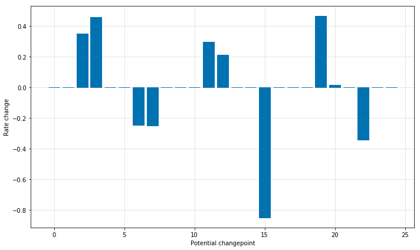

<center> If you are familiar with English, Here's the original text of the material:  </center>

<center>[Prophet Documentation](https://facebook.github.io/prophet/docs/quick_start.html#r-api) </center>

<center> The following text was written with reference to the above link.`r emo::ji("blush")` </center>

<style>
.math {
  font-size: small;
}
</style>

<br>

이 자료는 Facebook에서 제안하는 Prophet 모형을 소개하는 질 좋은 튜토리얼 자료를 찾고 있는 한국 R 유저들을 위해 만들었습니다. Facebook에서 훌륭한 [튜토리얼](https://facebook.github.io/prophet/docs/quick_start.html#r-api)을 제공하고 있으나, 영어로 된 자료라 영어에 능숙하지 않은 유저들은 약간 불편할 수 있겠다는 생각을 했어요. 안그래도 공부에 집중하기 힘든데, 영어로된 자료면 더 하기 싫을 때가 있죠. 물론, 해당 글도 Facebook에서 제공하는 튜토리얼을 기반으로 제 의견을 첨가하여 작성했습니다. 혹시 Prophet의 실제 적용뿐만 아니라, 자세한 이론적 부분이 궁금하다면 [제 블로그](https://be-favorite.tistory.com/64)를 참고해주시면 될 것 같습니다. 

Prophet 모형을 이렇게 소개하는 이유는 Prophet 논문 [Talyor and Letham (2018)](http://lethalletham.com/ForecastingAtScale.pdf)을 들여다 봤을 때, Facebook에서 해당 모형을 만든 motivation이 너무 매력적이었기 때문이에요. 시계열 예측 모형이 필요로 되는 실무자라면 이론적 부분은 차치하고 이 motivation만 이해해도 Prophet 모형을 얼른 적용해보고 싶을 겁니다:sunglasses::

* `r emo::ji("exclamation")`도메인 지식은 갖추었으나, 시계열을 다루는 지식이 부족한 실무자들을 위해
  + 실제 통계학 전공자들도 시계열 분석을 처음 공부할 때 어려움을 느끼는 경우가 많고, 대표적 통계적 시계열 예측모형이라 할 수 있는 ARIMA 모형을 실무에 적용하기 위해서는 공부해야할 것들이 많음(e.g 정상성)
* `r emo::ji("exclamation")`유연성(flexibility), 확장성(scalable)이 뛰어나며 Business time series에 유연하게 적용할 수 있는 모형의 필요성
  + ARIMA 모형은 각 자료가 갖는 특성들을 유연하고 세밀하게 반영하기 힘듬.
  
일단 첫 번째 motivation이 매우 감명깊었어요. Prophet 모형은 시계열을 3가지 요소로 분해하고 각 요소를 시간의 함수로 가법적으로 모형화하는데, 해당 자료에 대한 이해가 깊은 도메인 지식이 풍부한 실무자라면 이 튜토리얼만 잘 이해하고 수행해본다면 쉽게 모형을 advance할 수 있을거라고 생각합니다. 특히, 휴일효과(holiday effect)와 같은 것들을 아주 쉽게 사용자가 custom할 수 있다는 점이 아주 매력적이었어요. 

좀 더 자세한 Prophet 모형의 이론적 부분이 궁금하시다면 제가 글의 초반부에 말씀드린 제 블로그를 참고해주세요. 혹시, 제 블로그 글만으로 부족하다거나 모호한 부분이 있다면 해당 블로그의 글에 댓글을 달아주시거나 위의 Prophet 논문 링크를 클릭하여 참고하시면 더 좋을겁니다! 해당 튜토리얼이 단변량 시계열 예측 모형이 필요로 되는 실무자들에게 조금이나마 도움이 됐으면 좋겠습니다.`r emo::ji("blush")`

이제 튜토리얼을 하러 가봅시다.`r emo::ji("runner")`

## **1 Quick Start**
첫 번째 챕터는 Quick Start로 Prophet 모형 적합의 디테일한 부분을 설명하지 않고, 러프하게 소개한다. R에서 Prophet 모형을 제공하는 패키지는 {prophet}이다. 먼저 해당 패키지를 불러온다. 패키지가 설치되어 있지 않은 경우 `install.packages("prophet")`를 통해 CRAN(The Comprehensive R Archive Network)에서 내려받을 수 있다. 그리고, 해당 예제에서 쓸 추가적인 패키지를 불러온다. {vroom}은 파일을 읽을 목적으로, {tidyverse}는 data wragling, {lubridate}는 날짜를 다루기 위해 불러왔다. {lubridate}가 {base}의 날짜 함수들보다 훨씬 직관적이므로, 배워둘만한 가치가 있다(see, `vignette("lubridate", package = "lubridate")`).

```{r}
library(tidyverse)
```

```{r, message = FALSE}
library(prophet)
library(lubridate)
library(vroom)
loaded_package <- c("prophet", "vroom", "lubridate")
.version <- map(loaded_package, packageVersion)
names(.version) <- loaded_package
.version
```

[facebook의 Github repo prophet](https://github.com/facebook/prophet)에서는 각 챕터에 맞는 다양한 예제 자료를 제공하는데, Quick Start에서는 [Peyton Manning(NFL의 쿼터백)의 위키피디아 페이지 일별 조회 수에 로그를 취한 자료](https://github.com/facebook/prophet/blob/master/examples/example_wp_log_peyton_manning.csv)를 사용할 것이다.
```{r, message = "FALSE"}
wp_log_peyton <- vroom("./data/example_wp_log_peyton_manning.csv", delim = ",")
glimpse(wp_log_peyton)
```

Prophet 모형을 적합하는 `prophet::prophet()`에서는 기본적으로 날짜를 나타내는 열 `ds`와 측정값(또는 관측값, observed values)을 나타내는 열 `y`을 갖는 데이터프레임을 요구하며, 물론 티블도 문제없다. 페이스북에서 제공하는 toy data답게 해당 자료의 각 열의 이름과 그 성분은 `prophet()`에서 요구하는 것에 만족하므로, 따로 다른 처리를 해줄 것이 없다.
```{r}
summary(wp_log_peyton)
```

해당 자료의 조회 수는 2007-12-10부터 2016-01-20까지 일별로 기록되었다. 바로 Prophet을 적합해보자:
```{r, message = FALSE}
mod <- prophet(wp_log_peyton)
```

`prophet()`에는 조정할 수 있는 함수의 인수(argument)가 매우 다양한데, 이는 다음 챕터에서 자세하게 설명하려고 한다. 이번 챕터는 Quick Start니까.`r emo::ji("blush")` Prophet 모형의 예측은 날짜를 나타내는 열 `ds`를 갖는 데이터프레임을 기반으로 만들어진다. 다음의 `make_future_dateframe()`은 모형 객체와 예측 기간의 수를 인수로 받아, 해당 예측 기간의 날짜를 `ds` 열로 하는 데이터프레임을 만들어준다. 향후 1년을 예측하기 위해 `periods` 인수에 365를 설정하였다:
```{r}
future <- make_future_dataframe(mod, periods = 365)
glimpse(future)
```

예측은 R의 예측 모델링에서 흔히 쓰이는 함수 `predict()`로 수행한다. 앞서 만든 데이터프레임과 모형객체를 인수로 받는다. 그런데 `predict()`와 같은 함수는 어떻게 다양하고 서로 다른 모형 객체를 인수로 받아 그에 알맞는 예측값을 제공해 줄까? 이 궁금증은 Python의 기초를 배우며 풀리게 되었다. 해당 글의 주제와는 조금 벗어나지만 알아두면 나쁘지 않다고 생각하기 때문에 간단히 설명하고 넘어가려고 한다. 

Python에는 클래스(class)와 메서드(method)라는 개념이 존재한다. 하나의 클래스 내부에는 여러가지 함수가 존재하는데 이 각각의 함수를 메서드라고 칭한다. 클래스는 객체(object)를 표현하기 위한 문법으로, 프로그래밍에서 객체를 만들 때 사용하는 것이 클래스이다. 예를 들어 게임을 만든다고 하면 기사, 마법사 등의 직업별로 클래스를 만들어 표현할 수 있다. 그리고, "기사"라는 클래스를 표현하려면 체력, 마나 등이 필요하고 칼로 베기, 찌르기 등의 스킬이 있어야 한다. 여기서 전자를 클래스의 속성(attribute)이라 부르고, 후자를 메서드라 부른다. 이러한 프로그래밍 방법을 객체지향(object-oriented) 프로그래밍이라 한다. 객체지향 프로그래밍은 복잡한 문제를 잘게 나누어 객체로 만들고, 객체를 조합하여 문제를 해결한다. 객체지향 프로그래밍의 장점은 복잡한 문제를 처리하는데 유용하며, 기능을 개선하고 발전시킬 때도 해당 클래스만 수정하면 되므로 유지 보수에도 효율적이라는 점이다. 

R의 기초부터 배운 사람이라면 한번 쯤은 R이 객체지향 언어라는 말을 들어봤을 것이다. 즉, Python과 R은 객체 지향언어에 해당한다. R은 Python과 달리 개발을 주 목적으로 만들어진 언어는 아니므로, 클래스와 메서드 개념을 따로 배우지 않아도 코딩할 때는 사실 딱히 어려움이 없다. 물론, 나도 클래스와 메서드에 대한 개념이 없이 R을 오랫동안 사용했었지만 크게 어려움을 느끼진 않았다.`r emo::ji("sweat")` 그러나, 이러한 개념을 알아두면 R에서 편한점이 하나 있다. R에서 클래스, 메서드 개념을 몰라도 문제가 없었던 이유는 Python과는 달리 메서드를 생략해도 인수로 받는 객체에 따라 자동으로 알맞는 메서드를 호출하기 때문이다. 예를 들어, `predict()` 함수는 알다시피 R에서 여러가지 모형(e.g. lm(), randomForest()) 객체의 예측값을 불러온다. 이는 사실 각각의 모형 객체에 따라 적절한 메서드가 호출 되기때문이다. 예를 들어, 다음 코드 블럭에서 우리는 Prophet 모형 객체로부터 예측값을 얻기 위해 `predict()`를 사용하였지만, 사실은 `predict.prophet()`이 자동으로 호출된 것이다. 만약, python이였다면 메서드를 명시하여 `predict.prophet()`을 호출해야 했을 것이다. 이러한 개념을 알고 있을 때의 편한 점은 R의 강력한 `help()`기능에 이용할 수 있다는 것이다. 예를 들어, `?predict.prophet`, `help(predict.prophet)`을 하면 구체적으로 해당 메서드에 대한 설명과 사용법을 볼 수 있다. 클래스와 메서드에 대한 개념이 없었던 R 유저들은 이렇게 다양한 객체에 맞는 메서드를 자동으로 불러와서 실행되는 함수에서 궁금한 점을 마주했을 때 `?predict` 나 `help(predict)`를 수행하면 generic 함수에 대한 사항만 나와서 조금 곤란했던 경우가 있을 것이다. 이제 이런 문제를 겪지 않을 수 있다.`r emo::ji("smile")`

이제 다시 본론으로 돌아가서, 적합한 prophet 모형의 예측값을 생성하기 위해 `predict()`를 수행한다:
```{r, cache = TRUE}
pred <- predict(mod, future)
glimpse(pred)
```

Prophet 모형 객체에 `predict()`를 수행하면 여러 열을 갖는 데이터프레임 객체를 반환해준다. lower(하한)와 upper(상한)는 Prophet에서 제공하는 uncertainty interval에 해당하는데, 이 부분에 대한 설명은 챕터 3.5에서 자세하게 설명할 것이다. 본 챕터에서는 날짜, 예측값, 예측값의 하한, 상한 값만을 불러와서 검토해보자:
```{r}
pred %>% 
  select(ds, starts_with("yhat")) %>% 
  head()
```
그리고, `predict()`를 통해 반환된 예측값들을 갖는 객체와 Prophet 모형 객체로 `plot()`을 수행하면, uncertainty interval을 포함하는 관측값과 적합값의 시도표를 그릴 수 있다:
```{r, fig.align = "center", out.width = "60%", cache = TRUE}
plot(mod, pred)
```

위 그래프는 다음의 함수를 이용하면 interative하게 그릴 수도 있다:
```{r, fig.align = "center", out.width = "60%", cache = TRUE}
dyplot.prophet(mod, pred)
```

서론에서 Prophet 모형은 시계열을 3가지 요소(추세, 계절, 휴일효과)로 분해하고 각 요소를 시간의 함수로 모형화 한다는 말을 했었다. `prophet_plot_components()`를 이용하면 다음과 같이 시계열이 추세, 주별 계절성분, 연별 계절성분으로 분해된 것을 확인할 수 있다. 휴일효과는 모형 적합과정에서 반영하지 않았으므로 생략되었다. 휴일효과의 반영은 챕터 3.3.1에서 자세히 설명할 것이다.
```{r, fig.align = "center", out.width = "60%", cache = TRUE}
prophet_plot_components(mod, pred)
```

## **2 Details**
이제 모형 적합에서 고려할 수 있는 세부적인 인수들에 대해 파헤쳐보자. 

### 3.1 Saturaing Forecasts
Prophet에서는 예측값의 상한값과 하한값을 설정할 수 있다. 이를 영어로 Saturating Forecasts라 표현한다. 참고로, saturate는 "포화 상태로 만들다"라는 뜻이 있고 이를 풀어서 설명하면 어떤 것(st/sb)을 어떤 것으로 채우는 것이 불가능 하도록 또는 채울 필요가 없도록 완전히 채우는 것을 말한다(to fill something/somebody completely with something so that it is impossible or useless to add any more). 이번 챕터에서는 facebook의 Github에서 제공하는 [R의 위키피디아 페이지 일별 조회 수에 로그를 취한 자료](https://github.com/facebook/prophet/blob/master/examples/example_wp_log_R.csv)를 사용할 것이다.
```{r, message = FALSE}
wp_log_r <- vroom("./data/example_wp_log_R.csv", delim = ",")
```


#### 3.1.1 Forecasting Growth
Prophet은 디폴트 설정으로 예측에 선형 모형을 사용한다. 어떤 시계열의 성장(growth)에 대한 예측을 수행할 때, 보통 해당 시계열이 취할 수 있는 최댓값이 존재한다(e.g. 총 인구 수, 시장의 총 규모, etc.). 이를 "적재력(carrying capacity)"이라 칭하고, 예측값은 해당 지점에서 포화(saturate)되어야 한다. 그리고, Prophet에서는 예측에 선형 모형뿐만이 아닌 로지스틱 함수의 성장 추세(i.e. 비선형)를 갖는 모형을 사용할 수도 있으며, 해당 모형을 설정할 때는 적재력을 반드시 명시해야한다. 다음과 같이 자료에 `cap` 열을 추가하여 적재력을 명시할 수 있다(Prophet의 성장 모형화는 자연 생태계의 인구 성장 추세와 유사함). toy data로 진행되는 이번 튜토리얼에서는 특정값을 가정하여 사용할 것이나, 일반적으로는 시장 규모에 대한 전문적 지식이나 자료를 반영하여 설정된다.
```{r}
wp_log_r2 <- wp_log_r %>% 
  mutate(cap = 8.5)
```

주의할만한 점은 `cap`은 자료의 모든 행에에 명시되어야한다는 점이며, 꼭 상수값만을 취해야하는 것은 아니다. 만약 시장 규모가 성장한다면, `cap`도 증가하는 값을 갖도록 설정할 수 있다. 이제 `cap`을 설정한 자료를 바탕으로 비선형의 추세를 갖는 Prophet을 적합한다:
```{r}
mod_logistic <- prophet(wp_log_r2, growth = "logistic")
```

예측을 진행하는 다음의 과정은 전과 동일하나, `make_future_dateframe()`을 통해 생성되는 데이터프레임에도 cap을 명시해주어야 한다. 이번에는 향후 5년까지 예측을 수행할 것이다:
```{r, fig.align = "center", out.width = "60%", cache = TRUE}
future <- make_future_dataframe(mod_logistic, periods = 1826) %>% 
  mutate(cap = 8.5)
pred_logistic <- predict(mod_logistic, future)
plot(mod_logistic, pred_logistic)
```

#### 3.1.2 Saturating Minimum
로지스틱 성장 곡선의 추세를 갖는 Prophet 모형은 `floor`열을 명시하면 최솟값도 포화시켜 조정할 수 있다. 방식은 `cap`을 설정했던 것과 동일하다
```{r, fig.align = "center", out.width = "60%", cache = TRUE}
wp_log_r3 <- wp_log_r2 %>% 
  mutate(
    y = 10-y,
    cap = 6,
    floor = 1.5)
future2 <- future %>% 
  mutate(
    cap = 6,
    floor = 1.5)
mod_logistic <- prophet(wp_log_r3, growth = "logistic")
pred_logistic <- predict(mod_logistic, future2)
plot(mod_logistic, pred_logistic)
```

아울러, 최솟값으로 포화하는 로지스틱 성장 추세의 모형을 사용할 경우, 반드시 적재력을 나타내는 열 `cap`도 명시하여야 한다.

### 3.2 Trend Changepoints
Prophet은 시계열의 변화점(changepoints)을 자동으로 탐지하고 추세에 적절하게 반영한다. 이번 챕터에서는 이러한 변화점에 관한 것을 조정할 수 있는 몇 가지 인수들을 소개하고자 한다.

#### 3.2.1 Automatic changepoint detection in Prophet
Prophet은 수많은 잠재적 변화점(changepoints)을 명시함으로써 변화점을 탐지한다. 각 잠재적 변화점에서는 변화가 일어날  
비율(rate) $\delta_j$를 가지며, 여기서 $j = 1, \cdots,S$로 S 고려할 변화점의 총 갯수를 의미한다. 그리고, $\boldsymbol{\delta}$는 희소 사전분포(sparse prior)를 가정하며, 이는 Lasso 회귀의 목적함수에 쓰이는 L1-regularization과 동일하다. 즉, 이는 본질적으로 Prophet 모형은 변화점이 될 수 있는 수많은 지점을 명시한 뒤에 그 중 가능한한 적은 지점을 변화점으로 사용하게 될 것임을 의미한다. 보통 많은 수의 변화점을 명시하고(e.g. 수년간 수집된 자료에 대해 월별로 변화점 명시) 사전분포로 $\delta_j \sim {\rm{Laplace}}(0, \tau)$를 사용한다(See, [Talyor and Letham (2018)](http://lethalletham.com/ForecastingAtScale.pdf) - 3.1 The Trend Model). 여기서 모수 $\tau$는 비율 $\delta_j$를 변화시킴으로써 모형의 유연성(flexibility)을 조절한다. $\tau$를 0까지 감소시키면 일반적인(standard, not-piecewise) 로지스틱 또는 선형 성장 곡선을 갖는 추세를 이루게 된다(i.e. 변화점이 없는 것과 동일).

Quick Start 챕터에서 수행했던 Peyton Manning의 위키피디아 페이지 조회수 예측을 고려해보면, Prophet은 다음 그림에서 처럼 default로 25개의 잠재적 변화점을 시계열의 시작 날짜부터 80% 지점까지 균일하게 둔다:
```{r figure1, echo = FALSE, fig.cap = "출처: facebook.github.io", fig.align = "center", out.width = "60%"}

```

여기서 점선으로 그어진 수직선이 곧 잠재적 변화점을 의미한다. 수많은 잠재적 변화점을 두긴 했지만, 변화가 일어날 가능성($\delta_j$)의 조절이 희소 사전분포로 이루어지기 때문에 대부분의 변화점들은 사용되지 않을 것이다. 이는 각 변화점에서 비율의 크기를 시각화하여 확인할 수 있다:
```{r figure1, echo = FALSE, fig.cap = "출처: facebook.github.io", fig.align = "center", out.width = "60%"}

```
잠재적 변화점은 default로 25개가 고려되는데, 모형 적합을 수행하는 함수 `prophet()`의 `n_changepoints` 인수 통해 조정할 수 있다. 다만, `n_changepoints`은 자료에 따라 최적의 값이 다르므로 분석자의 직관에 의존하지 않은 regularization을 통한 튜닝이 필요로 될 것이다. 여기서 잠깐만 용어 정리를 하고 가자.

* regularization: training error가 아닌 generalization error를 줄이는 모든 행위를 통칭함. 즉, 해당 학습 알고리즘에 어떤 수정(modification)을 가하는 행위를 말함.
* generalization: 모형 적합에 쓰이지 않은 자료(unobserved data, i.e. test data)에도 좋은 성능을 보여주는 능력을 말함. 즉, 시험 자료(test data)에 대한 error는 generalization error에 해당.

이렇게 굳이 용어 정리를 하고가는 이유는, 위와 같이 [머신러닝에서 자주 등장하는 용어](https://be-favorite.tistory.com/30?category=894492)들을 간혹 머릿속에 정의가 확실하게 안된채로 혼동하여 쓰는 경우를 많이 봤기 때문이다. 용어 정의가 확실히 안되면 글을 쓰는 사람, 읽는 사람, 강의를 하는 사람, 듣는 사람 모두가 힘들어 진다.`r emo::ji("disappointed_relieved")` 특히, 통계학, 머신러닝 등의 도메인에서는 정확한 용어 정의가 중요하다.

다시 본론으로 돌아와서, 이러한 잠재적 변화점들의 시각화는 `add_changepoints_to_plot()`을 이용하면 된다. {prophet}의 그림들은 {ggplot2} 형태로 그려지기 때문에, 다음과 같이 `+` 연산자를 사용하여 레이어를 쌓을 수 있다.
```{r, fig.align = "center", out.width = "60%", cache = TRUE}
plot(mod, pred) + 
  add_changepoints_to_plot(mod)
```

잠재적 변화점이 default로 시계열의 시작 날짜부터 80% 지점까지 설정되는 이유는 추세를 확실하게 파악하기 위해 충분한 시계열의 길이를 확보하기 위함이며, 끝의 20% 부분에서 잠재점 변화점을 고려하지 않는 이유는 시계열의 끝부분에서 탐지되는 변화점들에 의해 과적합이 일어나는 것을 방지하기 위함이다. 이러한 `prophet()`의 default 값은 꽤 잘 작동하는데, 모든 상황에서 그렇진 않으며 `changepoint_range` 인수을 통해 조정이 가능하다. 예를 들어, `prophet(data, changepoint.range = 0.9)`는 시작 지점부터 90% 지점까지의 잠재적 변화점을 고려하라는 말이다.

#### 3.2.2 Adjusting trend flexibility
만약 추세 변화가 과적합 또는 과소적합 되었다면,  `change_prior_scale`로 희소 사전분포의 강도를 조정하여 추세 변화의 유연성(flexibility)을 조절할 수 있다. 여기서 `change_prior_scale` 인수의 역할은 3.2.1에서 봤던 $\tau$를 조정하는 것이라고 보면 된다. 즉, `change_prior_scale`의 크기를 키울수록 추세 변화는 flexible해지고, 과적합 가능성이 있을 것이다. 해당 인수의 default 값은 0.05로 설정되어 있다. 다음과 같이 0.5로 키우면 탐지된 추세가 더 flexible 해짐을 확인할 수 있다:
```{r, message = FALSE, fig.align = "center", out.width = "60%", cache = TRUE}
mod <- prophet(wp_log_peyton, changepoint.prior.scale = 0.5)
future <- make_future_dataframe(mod, periods = 365)
pred <- predict(mod, future)
plot(mod, pred)
```

반대로, 줄이면 다음과 같이 추세의 flexibility를 줄일 수 있다:
```{r, message = FALSE, fig.align = "center", out.width = "60%", cache = TRUE}
mod <- prophet(wp_log_peyton, changepoint.prior.scale = 0.001)
plot(mod, pred)
```

적절한 `changepoint.prior.scale`을 찾기 위해서는 튜닝이 필요하다. 이는 3.8.1의 교차검증에서 다룰 것이다.

#### 3.2.3 Specifying the locations of the changepoints
마지막으로, 변화점의 위치를 자동으로 결정하는 것이 아닌 분석자가 그 위치를 명시할 수도 있다. `changepoint` 인수에 변화점이 놓이기를 원하는 날짜를 설정해주면 된다. 그럼 추세의 잠재적 변화점은 해당 지점에서만 고려될 것이다.
```{r, message = FALSE, fig.align = "center", out.width = "60%", cache = TRUE}
mod <- prophet(wp_log_peyton, changepoints = c("2014-01-01"))
plot(mod, pred) + 
  add_changepoints_to_plot(mod)
```

### 3.3 Seasonality, Holiday Effects, And Regressor
이번 챕터에서는 계절성, 휴일효과, 그리고 추가적인 회귀자(regressor)도 custom하는 것에 방법에 대해 소개한다. 챕터 하나하나를 배우면서 자료의 특성을 완성도있게 반영할 수 있는 당신만의 Prophet 모형을 설정할 수 있을 것이다.`r emo::ji("smile")`

#### 3.3.1 Modeling Holidays and Special Events
먼저, 휴일 또는 특별한 이벤트가 있는 날을 모델링하는 방법에 대해 알아보자. 꽤나 직관적으로 어렵지 않게 휴일효과를 반영할 수 있다.

#### 3.3.2 Built-in Country Holidays
#### 3.3.3 Fourier Order for Seasonalities
#### 3.3.4 Specifying Custom Seasonalities
#### 3.3.5 Seasonalities that depend on other factors
#### 3.3.6 Prior scale for holidays and seasonality
#### 3.3.7 Additional regressors


### 3.4 Multiplicative Seasonality

### 3.5 Uncertainty Intervals
#### 3.5.1 Uncertainty in the trend
#### 3.5.2 Uncertainty in seasonality

### 3.6 Outliers

### 3.7 Non-Daily Data
#### 3.7.1 Sub-daily data
#### 3.7.2 Data with regular gaps
#### 3.7.3 Monthly data
#### 3.7.4 Holidays with aggregated data

### 3.8 Diagnostics
#### 3.8.1 Parallelizing cross validation
#### 3.8.2 Hyperparameter tuning

## **4 Additional Topics**

### 4.1 Saving models
### 4.2 Flat trend and custom trends
### 4.3 Updating fitted models

## **5 Getting Help and Contributing**
